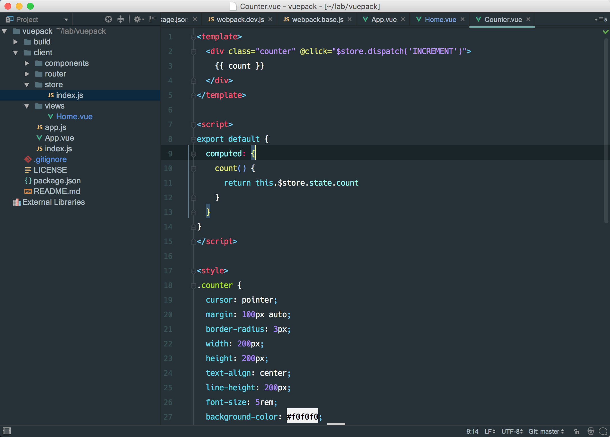

# agileTheme
a very beautiful theme for webstorm

because i am a virgo programmer. I take a lot time on the color and fonts. now i find my best theme.

###  Two font suggest

[Fantasque-sans](https://github.com/belluzj/fantasque-sans) 

[Hack](https://github.com/chrissimpkins/Hack) (screenshot use)

### Screen shot

### How to use
1. Download the `agile.jar` [theme](https://raw.githubusercontent.com/agileago/agileTheme/master/agileTheme.jar)
2. open `webstorm` and select the `File -> Import setting` take the theme and restart `webstorm`. enjoy it !
